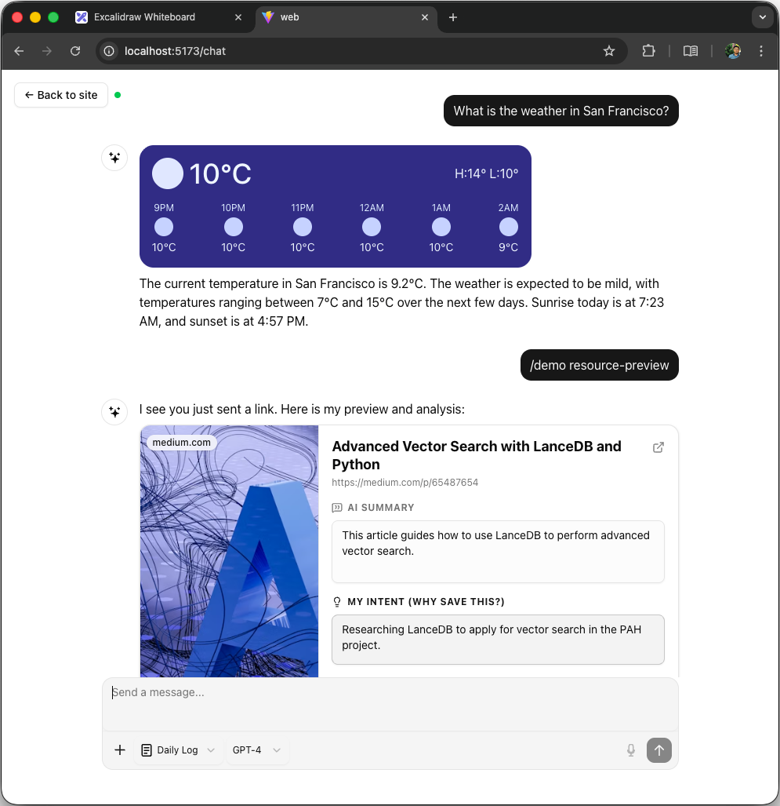
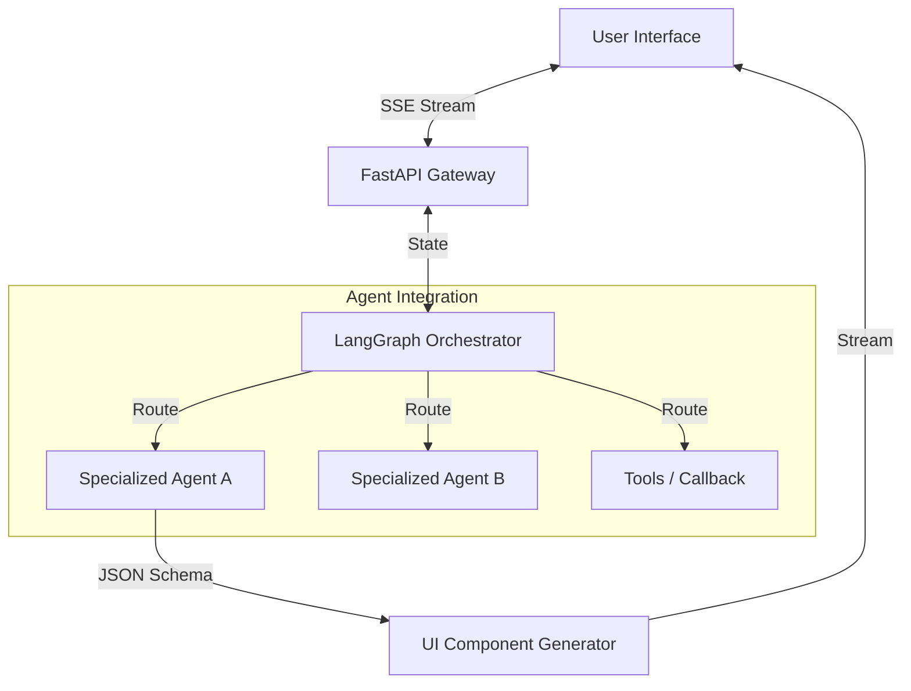

# Agentic Interface Boilerplate

> **Agent First. No Dashboard.**  
> A modern framework for building intelligent, agentic applications where the interface is generated dynamically by the AI, for the user.

## 🚀 Motivation

The traditional web application model relies on static dashboards, endless forms, and rigid navigation structures. Users are forced to learn the interface to get things done.

**We believe in a different future:**
*   **Agent First**: The core of the application is an intelligent agent (or fleet of agents) that understands user intent.
*   **No Dashboard**: Instead of navigating complex menus, the UI is ephemeral and context-aware. The agent "generates" the necessary UI components (Generative UI) right in the chat stream when they are needed.
*   **Conversational + Visual**: Text is great, but rich interactions require rich UI. This boilerplate seamlessly blends natural language processing with interactive React components.



This repository serves as a **production-ready foundation** for building such applications, combining the best-in-class tools for AI orchestration and reactive frontend development.

---

## 🛠 Tech Stack

### Frontend (The Interface)
*   **Framework**: [React](https://react.dev/) + [Vite](https://vitejs.dev/) (Speed & Performance)
*   **Language**: TypeScript (Type safety)
*   **AI Integration**: [Vercel AI SDK](https://sdk.vercel.ai/) (Streaming & UI Generation)
*   **Styling**: [TailwindCSS](https://tailwindcss.com/) v4
*   **Components**: [Shadcn UI](https://ui.shadcn.com/) (Accessible & Customizable)
*   **State Management**: Zustand

### Backend (The Brain)
*   **API**: [FastAPI](https://fastapi.tiangolo.com/) (High performance Async API)
*   **Orchestration**: [LangGraph](https://langchain-ai.github.io/langgraph/) (Stateful, multi-agent workflows)
*   **LLM Interface**: [LangChain](https://www.langchain.com/)
*   **Database**: SQLite (Dev) / Postgres (Prod) with `asyncpg` & `sqlmodel`
*   **Real-time**: Server-Sent Events (SSE) for streaming agent thoughts and UI events

---

## 🏗 Architecture

The system follows a reactive, event-driven architecture:



1.  **Orchestrator**: A master graph that routes user queries to the most appropriate sub-agent.
2.  **Generative UI**: Agents don't just return text; they return structured data that the frontend maps to rich React components (Prompt Cards).
3.  **Human-in-the-loop**: Support for "Callback" agents that can ask clarifying questions or request user confirmation via UI forms.

---

## 🏁 Getting Started

### Prerequisites
*   Python 3.10+
*   Node.js 18+
*   OpenAI API Key (or compatible)

### 1. Backend Setup

```bash
# Create virtual environment
python -m venv .venv
source .venv/bin/activate  # or .venv\Scripts\activate on Windows

# Install dependencies
pip install -r src/backend/requirements.txt

# Environment Setup
cp .env.example .env
# Edit .env and add your LLM_API_KEY
```

Run the server:
```bash
sh scripts/dev_backend.sh
# Server runs on http://localhost:8000
```

### 2. Frontend Setup

```bash
sh scripts/dev_web.sh
# App runs on http://localhost:5173
```

---

## 🧩 Development Guide

### Adding a New Agent
1.  **Define the State**: Update `src/backend/app/agents/state.py` if your agent needs specific state keys.
2.  **Create the Node**: Create `src/backend/app/agents/your_agent.py`. Define a function that takes `AgentState` and returns an update.
3.  **Register the Node**: Add your agent to the graph in `src/backend/app/agents/orchestrator.py`.
4.  **Add Routing Logic**: Update the router in `orchestrator.py` to direct relevant queries to your new agent.

### Adding a New "Generative" UI Component
1.  **Backend**: In your agent, return a tool call or structured response with a specific `type` identifier (e.g., `weather_card`).
2.  **Frontend**: Create the React component in `src/web/src/components/ai-elements/`.
3.  **Registry**: Register the component map in the Vercel AI SDK rendering logic (usually in the chat page or a custom hook).

---

## 🤝 Contributing
Contributions are welcome! Please read our contributing guidelines and code of conduct.

## 📄 License
MIT
